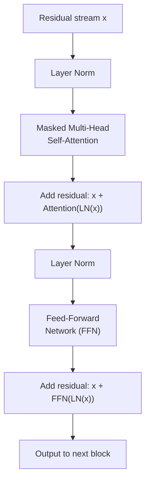

# Transformer Architecture

The decoder-only transformer is the dominant architecture behind GPT-family models, LLaMA, Mistral, and most production LLMs. The NCA exam weights this under "Core ML and AI Knowledge" (30%); the NCP exam has a dedicated "LLM Architecture" domain (6%) that tests the same material with more precision. This note is the cert-focused synthesis — the dimensions are verified against the original Transformer paper (Vaswani et al., 2017), and the design decisions are framed around the trade-offs the exams probe.

For a full interactive walkthrough, RTL implementation, and PyTorch code see [LLM\_Hub\_Transformer\_Architecture](https://github.com/BrendanJamesLynskey/LLM_Hub_Transformer_Architecture). For modern variants (MoE, SSM, hybrids) see [LLM\_Hub\_Modern\_Architectures](https://github.com/BrendanJamesLynskey/LLM_Hub_Modern_Architectures).

---

## From tokens to logits: the full pipeline

A decoder-only model processes a sequence of tokens and produces a probability distribution over the next token. The pipeline is:

1. **Tokenisation** — raw text is split into tokens by a vocabulary-based tokeniser (BPE or SentencePiece). Each token is an integer index into the vocabulary (typical size: 32 000–128 000 tokens).
2. **Token embedding** — each token index is looked up in a trainable embedding matrix E ∈ ℝ^{V×d_model}, producing a dense vector of dimension d_model.
3. **Positional encoding** — sequence-order information is injected. See the next section.
4. **Stack of N decoder blocks** — the residual stream passes through N identical blocks, each containing a self-attention sub-layer and a feed-forward network (FFN) sub-layer. See below.
5. **Unembedding** — the final hidden state is projected back to vocabulary dimension via a linear layer (often the transposed embedding matrix — weight tying). This produces logits ∈ ℝ^V.
6. **Softmax** — logits are converted to a probability distribution over the vocabulary. During training, cross-entropy loss is computed against the next-token target. During generation, the distribution is sampled (or greedy-decoded) to produce the next token, which is then appended and the process repeats.

The output dimension d_model is the width of the residual stream. All sub-layers within a block must produce outputs of the same dimension so they can be added back to the stream.

---

## Positional encoding

Attention has no inherent notion of token order — if you permute the input, a pure attention layer produces permuted but otherwise identical outputs. Positional information must be injected explicitly.

**Absolute sinusoidal encoding** (original Transformer paper): fixed sine and cosine waves of different frequencies are added to the embedding at each position. Position i and dimension 2k gets sin(i / 10000^{2k/d_model}), and dimension 2k+1 gets the corresponding cosine. No learned parameters; the model can extrapolate to longer sequences in principle, but in practice performance degrades.

**Learned absolute embeddings**: a trainable positional embedding matrix of shape (max_seq_len, d_model) is added to the token embeddings. Used in GPT-2, BERT. Cannot extrapolate beyond the trained maximum length.

**RoPE — Rotary Position Embedding** (Su et al., 2021): rather than adding a positional vector, RoPE rotates the Q and K vectors in each attention head by an angle proportional to position. The crucial property is that the dot product Q·Kᵀ between positions i and j depends only on the relative displacement i − j, not on absolute positions. This gives the model explicit relative-position awareness in the attention score, with no additional parameters. RoPE also provides a natural mechanism for length extrapolation — models such as LLaMA, Mistral, and Qwen use YaRN or ABF variants to extend context length at inference. RoPE is the dominant approach in open-weight models as of 2026.

**ALiBi — Attention with Linear Biases** (Press et al., 2021): instead of modifying embeddings or rotations, ALiBi adds a linear penalty to the attention score that grows with relative distance: score(i,j) = QᵢKⱼᵀ/√d_k − m·|i−j|, where m is a head-specific constant. No learned parameters; the recency bias is baked in. ALiBi enables good length extrapolation at inference time and trains faster than sinusoidal baselines. Used in MPT, BLOOM.

Exam distinction: RoPE modifies Q and K before the dot product; ALiBi adds a bias after the dot product but before softmax.

---

## Attention: Q, K, V, scaling, and masking

The central operation in a decoder block is masked multi-head self-attention.

**Single-head scaled dot-product attention**:

Given an input sequence represented as matrix X ∈ ℝ^{seq×d_model}, three linear projections produce:

- Queries: Q = XW_Q, W_Q ∈ ℝ^{d_model×d_k}
- Keys:    K = XW_K, W_K ∈ ℝ^{d_model×d_k}
- Values:  V = XW_V, W_V ∈ ℝ^{d_model×d_v}

The output is:

Attention(Q, K, V) = softmax(QKᵀ / √d_k) · V

**Scaling by 1/√d_k**: without scaling, dot products grow in magnitude as d_k increases, pushing softmax into regions of extremely small gradient (the distribution becomes close to a one-hot). Dividing by √d_k keeps the pre-softmax scores in a variance-stable range. In the original paper, base model: d_k = d_v = 64; big model: d_k = d_v = 64 with h = 16 heads.

**Causal masking** (decoder self-attention): a triangular mask adds −∞ to positions j > i before softmax, so position i cannot attend to any future position. After softmax, those positions have weight ≈ 0. This enforces the autoregressive property — the model predicts each token using only prior context.

**Padding mask**: used in batch training to prevent tokens from attending to padding tokens. Separate from causal masking and applied to both encoder and decoder.

**Multi-head attention**: rather than one large attention computation, the query/key/value projections are split into h parallel "heads", each operating with d_k = d_model/h dimensions. The outputs are concatenated and linearly projected: MultiHead = Concat(head₁, …, headₕ)W_O. Multiple heads allow the model to attend to different aspects of the context simultaneously (different syntactic roles, different semantic relations). In the original Transformer base model: h = 8, d_k = 64, d_model = 512.

**Grouped-Query Attention (GQA)**: a memory-efficiency variant where multiple query heads share a single key-value head. In the limit of one KV group this is Multi-Query Attention (MQA). GQA reduces the KV cache footprint at inference, which is critical on constrained hardware such as an RTX 3080 (10 GB). LLaMA-3 and Mistral use GQA.

---

## Decoder block structure

A single decoder block contains two sub-layers, each wrapped in a residual connection and a layer normalisation.

**Pre-norm vs post-norm**: the diagram above shows pre-norm (LayerNorm before the sub-layer), which is the default in modern transformers. The original Transformer paper used post-norm (LayerNorm after the residual addition). Pre-norm provides more stable gradients at depth and allows higher learning rates; post-norm can achieve slightly lower final loss but requires careful warmup. GPT-2 and LLaMA use pre-norm.

**FFN block**: a two-layer MLP with a non-linear activation in between.

Standard: FFN(x) = W₂ · ReLU(W₁x + b₁) + b₂

With SwiGLU (LLaMA-style): FFN(x) = (W₁x · SiLU(W₂x)) · W₃

The inner dimension d_ff is typically 4·d_model for standard FFNs and ~(8/3)·d_model for SwiGLU (adjusted to keep parameter count comparable). In the Transformer base model d_ff = 2048 = 4 × 512.

**Residual connections**: each sub-layer adds its output to its input, forming the "residual stream". This provides a gradient highway through the full depth of the network — gradients can flow directly from the output to early layers without passing through every operation. Without residuals, deep transformers are essentially untrainable.

**Layer norm**: normalises activations to zero mean and unit variance within each token's feature dimension, then applies learned scale (γ) and shift (β) parameters. RMSNorm (used in LLaMA) drops the mean-subtraction step, keeping only the scale normalisation — it is faster and empirically equivalent.

---

## KV cache during autoregressive decoding

During generation, the model processes one new token per step and produces one output token. Without caching, computing attention for step t requires re-computing Q, K, V for all t prior tokens. The KV cache stores the K and V projections for all previous positions so that only the new token's Q, K, V need to be computed at each step.

Cost without cache: O(t²·d_model) per step (the full QKᵀ for a growing sequence). With cache: O(t·d_model) per step for the new token's attention against the cached K, V.

Memory cost: the KV cache grows as 2 × N × h × d_k × t × bytes_per_element. For a 7B-parameter model with 32 layers, 32 heads, d_k = 128, in FP16, at sequence length 4096: 2 × 32 × 32 × 128 × 4096 × 2 bytes ≈ 2 GB. On an RTX 3080 (10 GB) this is a significant fraction of available VRAM and motivates GQA/MQA and 4-bit quantisation. Paged attention and KV-cache quantisation are covered in [notes/08\_inference\_optimisation.md](08_inference_optimisation.md).

---

## Decoder-only vs encoder-decoder vs encoder-only

| Architecture | Self-attention mask | Cross-attention | Typical use |
|---|---|---|---|
| Encoder-only | Bidirectional (no causal mask) | None | Classification, embedding, NER |
| Encoder-decoder | Encoder: bidirectional; decoder: causal | Decoder attends to encoder output | Translation, summarisation, seq2seq |
| Decoder-only | Causal (autoregressive) | None (or prefix attention) | Language modelling, instruction following, generation |

The original Transformer paper (Vaswani et al., 2017) presented an encoder-decoder architecture for machine translation. The encoder-only paradigm is exemplified by BERT; the decoder-only paradigm by GPT. Modern large-scale LLMs (GPT-4, LLaMA, Mistral, Gemma) are almost universally decoder-only, because decoder-only models trained on next-token prediction scale more efficiently to general-purpose language tasks than encoder-decoder models trained on specific seq2seq objectives.

Encoder-only models remain the better choice for discriminative tasks (e.g. sentence embedding, text classification) where you need a dense representation of a full input rather than generation.

---

## Modern architecture variants (brief)

Full treatment is in [LLM\_Hub\_Modern\_Architectures](https://github.com/BrendanJamesLynskey/LLM_Hub_Modern_Architectures).

**Mixture of Experts (MoE)**: replaces the dense FFN with a set of expert FFNs; a gating network selects the top-K experts for each token. Total parameter count increases but active parameter count (and thus FLOPs per token) stays constant. Switch Transformer and Mixtral 8×7B are canonical examples. The [Arch\_01\_MoE](https://github.com/BrendanJamesLynskey/Arch_01_MoE) repo covers the trade-offs in depth.

**Mamba / SSMs (Selective State Space Models)**: replace attention with a recurrent formulation based on selective state-space models. Time complexity is O(n) vs O(n²) for attention. Mamba-2 and Jamba (a hybrid) are production examples. Tradeoffs: SSMs are less sample-efficient on tasks requiring sharp content-based retrieval; hybrids interleave attention and SSM layers.

**Hybrid models**: combine attention (for global content-based retrieval) with SSM or convolution layers (for cheap local processing). The field is active but decoder-only transformers with RoPE and GQA remain the majority of production deployments.

---

## Likely exam angles

- **Scaling 1/√d_k**: the rationale is that large d_k causes dot products to grow in magnitude, pushing softmax gradients to near-zero. Distractors often claim the scaling is for normalising the output magnitude of the projection.
- **Pre-norm vs post-norm**: modern models (GPT-2, LLaMA) use pre-norm because it is more stable at depth. The original paper used post-norm. An exam question may ask which is used in a specific architecture.
- **KV cache memory formula**: growth is proportional to sequence length × number of layers × number of KV heads × d_k × 2 (K and V) × bytes per element. GQA reduces the number of KV heads without reducing query heads.
- **Encoder-only vs decoder-only**: encoder-only (BERT) uses bidirectional attention and is not autoregressive — it is used for representation/classification, not generation. Decoder-only uses causal masking and produces one token per step.
- **RoPE vs ALiBi**: RoPE modifies the Q and K vectors directly via rotation; ALiBi adds a distance-based linear bias to the attention scores. Both enable length extrapolation, but through different mechanisms.
- **Residual connections**: the primary purpose is gradient flow (avoiding vanishing gradients at depth), not activation normalisation. Layer norm handles activation scale; residuals handle gradient scale.

---

## Further reading

- Vaswani et al., "Attention Is All You Need" (2017): [https://arxiv.org/abs/1706.03762](https://arxiv.org/abs/1706.03762) — encoder-decoder baseline; base model has N=6, d_model=512, h=8, d_k=64, d_ff=2048.
- Su et al., "RoFormer: Enhanced Transformer with Rotary Position Embedding" (2021): [https://arxiv.org/abs/2104.09864](https://arxiv.org/abs/2104.09864)
- Press et al., "Train Short, Test Long: Attention with Linear Biases Enables Input Length Extrapolation" (ALiBi, 2021): [https://arxiv.org/abs/2108.12409](https://arxiv.org/abs/2108.12409)
- Dao et al., "FlashAttention" (2022): [https://arxiv.org/abs/2205.14135](https://arxiv.org/abs/2205.14135) — IO-aware exact attention; relevant to efficient training.
- Ainslie et al., "GQA: Training Generalised Multi-Query Transformer Models from Multi-Head Checkpoints" (2023): [https://arxiv.org/abs/2305.13245](https://arxiv.org/abs/2305.13245)
- [LLM\_Hub\_Transformer\_Architecture](https://github.com/BrendanJamesLynskey/LLM_Hub_Transformer_Architecture) — interactive visual walkthrough, RTL implementation, PyTorch from scratch.
- [LLM\_Hub\_Modern\_Architectures](https://github.com/BrendanJamesLynskey/LLM_Hub_Modern_Architectures) — MoE, Mamba, hybrids.
